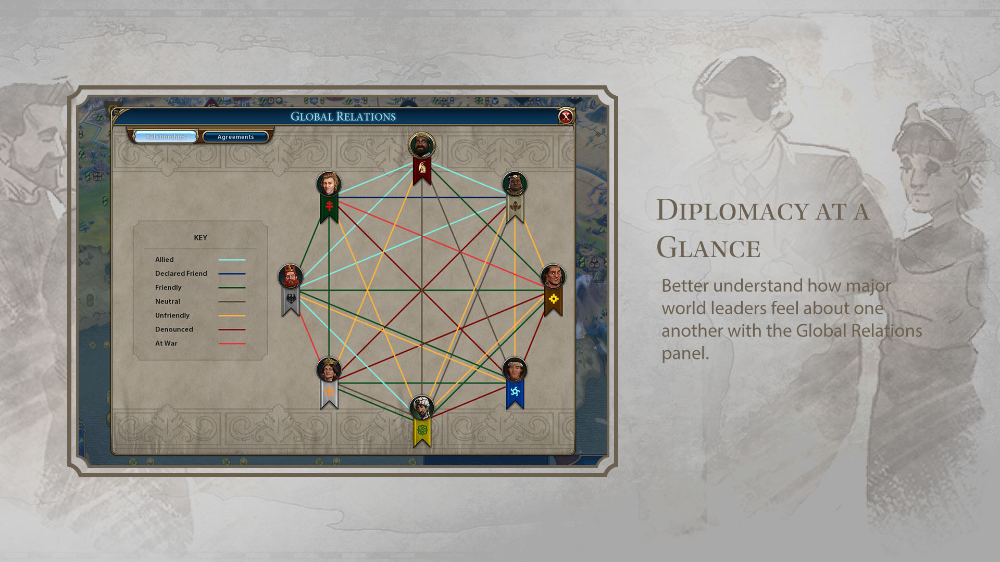
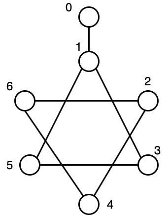
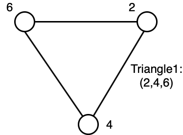
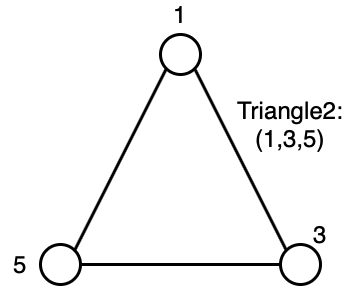
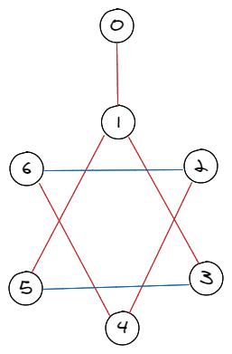

# Seeking a Diplomatic Blance  using Grover's Algorithm

## Background

The diplomatic relationship is a result of the previous interactions between two civilizations, and in turn has a strong impact on both communities in the future. Although diplomatic relationships between two countries can be multi-level, in this project we consider two extreme status -- either being allied or in conflict -- and we ignore the other status in between. 

Wars are undoubtly disastrous for civilizations. However, the alliance of several strong powers would also encourage the ambition of evil politicians. In order to prevent hegemony or large scale wars, a balance of cooperations and disagreements between civilizations is more desirable. We would expect no evil axis leagues or world wars among the close circle of any three civilizations. 


A cartoon showing relationships between different civilizations in the strategic game _Sid Meier's Civilization VI_. Credit: [Steam - Sid Meier's Civilization VI - Workshop - sukritact's Workshop](https://steamcommunity.com/sharedfiles/filedetails/?id=1753346735&searchtext=relation)

## Problem Setting

These ally-conflict relationsips between civilizations forms a graph, where the civilizations are the vertices, and the ally-or-conflict relationships are the edges with two possible colors. In this project, we are specifically considering a graph as follows, where there are seven civilizations and they form two triangular diplomatic relationships. For each edge, they can have one of two possible colors. 
     


 

Our desirable result is that neither of the two triangles have the same color in all their three edges. In this project, we will use the Grover's algorithm to seek solutions that satisfy our requirements.

In the above example, the codes first find the closed circle triangles in the graph. The corresponding three vertices of each triangle are recorded in the an array `indicesEdges` of 2-tuples.

## Requirements and Manifest

In order to run the `grovers.qs` on your local machine, you need to download the Microsoft [Quantum Development Kit](https://docs.microsoft.com/azure/quantum/install-overview-qdk/).

To run the project, use `dotnet run` command under the project folder from your terminal.

There are just two meaningful files in this project:

- [Readme.md](Readme.md): an introduction to the project.
- [grovers.qs](grovers.qs): the single Q# script file which implements Grover's algorithm to search for diplomatic relations satisfying the triangle-free constraint.

The parameters are hard coded in the script so there are no user inputs to run the script. However, the parameters are located at the `@EntryPoint()` operation, with readable names, and documented with comments. Users can change parameters as they like. 

The parameters that describes the graph are:
- `nCivlizations`: number of civilization, i.e. number of vertices
- `relationsDiplomacy`: the pairs of civilizations that have a specific diplomatic relationship with each other, ie. edges

## Implement of Grover's Algorithm

The implement can be grouped into 3 sections.

First, similar to the Challenge 4 in Part1, we define a marked oracle that will flip the `output` qubit if there are not any triangles whose edges share the same color. This is done in the operation `TriangleFreeColoringOracle`, with the helper function `FindTriangles`, and helper operation `CheckValidTriangle`.

Then we need to turn the marking oracle to a phase oracle so that we can feed to the Grover's search. This is done in `MarkingOracleToPhaseOracle`.

The core of Grover's search is in `RunGroversAlgorithm`.

## Sample Output ##

This is the direct text output of the script.

```
A balanced international relationship: 
Relationship (0, 1) - In conflict
Relationship (1, 3) - In conflict
Relationship (1, 5) - In conflict
Relationship (2, 4) - In conflict
Relationship (2, 6) - Allied     
Relationship (3, 5) - Allied     
Relationship (4, 6) - In conflict
```

Based on this output, we colored the edges in the cartoon above, and here is the result:



We can see neither triangles have all three edges in the same color.
